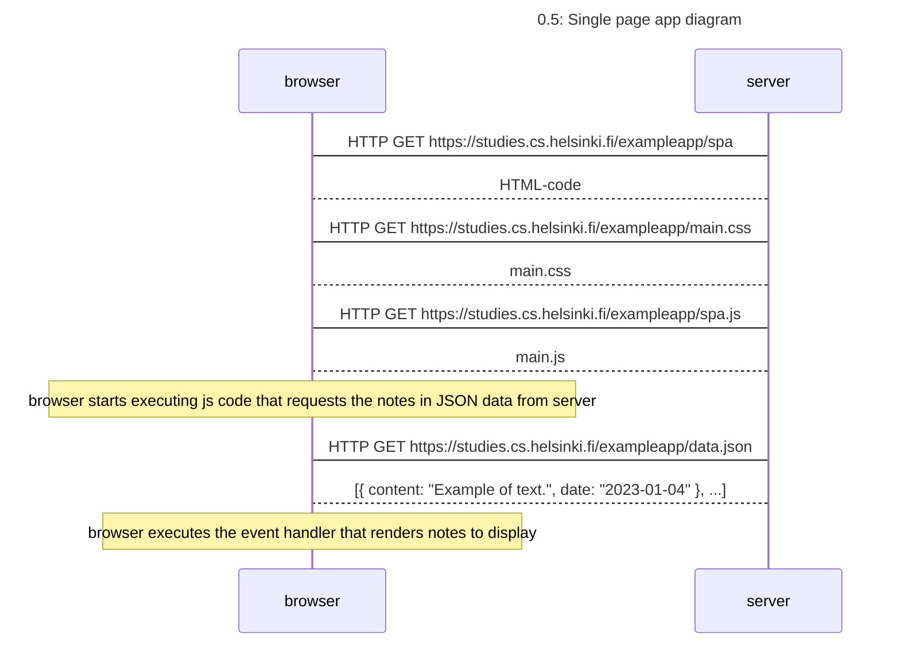

```mermaid
sequenceDiagram
    Title: 0.5: Single page app diagram

    browser->server: HTTP GET https://studies.cs.helsinki.fi/exampleapp/spa
    server-->browser: HTML-code
    browser->server: HTTP GET https://studies.cs.helsinki.fi/exampleapp/main.css
    server-->browser: main.css
    browser->server: HTTP GET https://studies.cs.helsinki.fi/exampleapp/spa.js
    server-->browser: main.js

    note over browser: browser starts executing js code that requests the notes in JSON data from server

    browser->server: HTTP GET https://studies.cs.helsinki.fi/exampleapp/data.json
    server-->browser: [{ content: "Example of text.", date: "2023-01-04" }, ...]

    note over browser: browser executes the event handler that renders notes to display


```